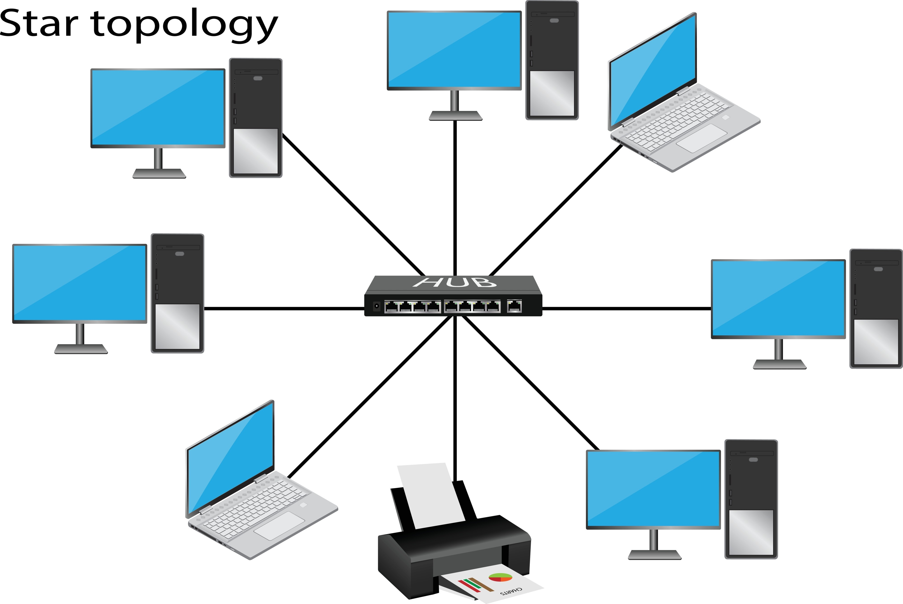
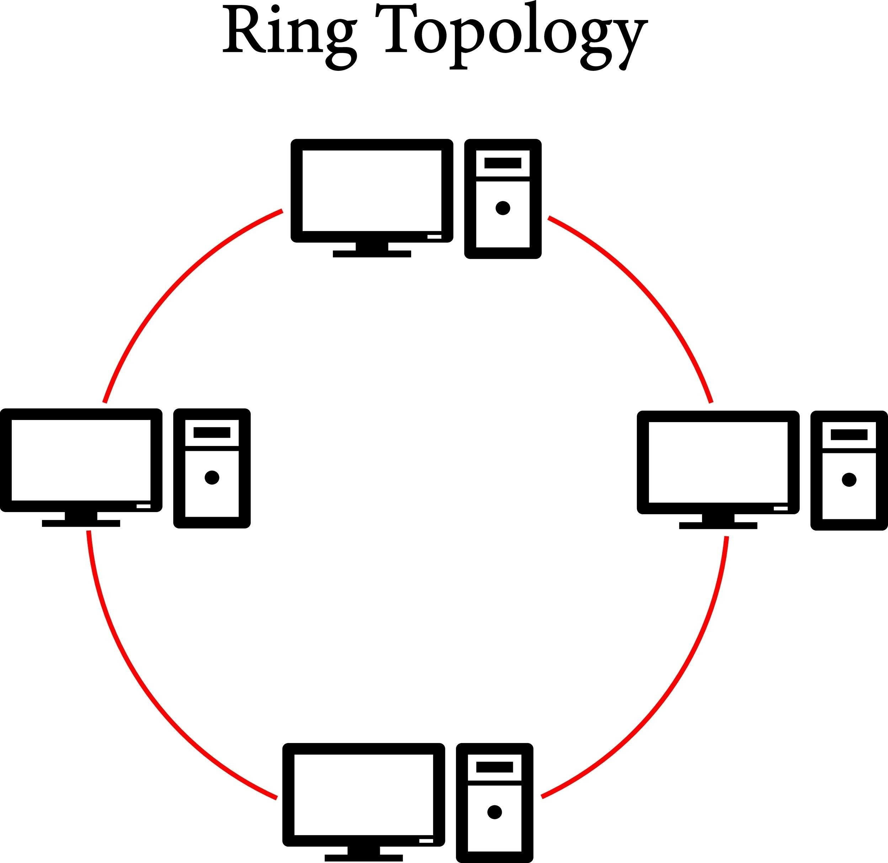
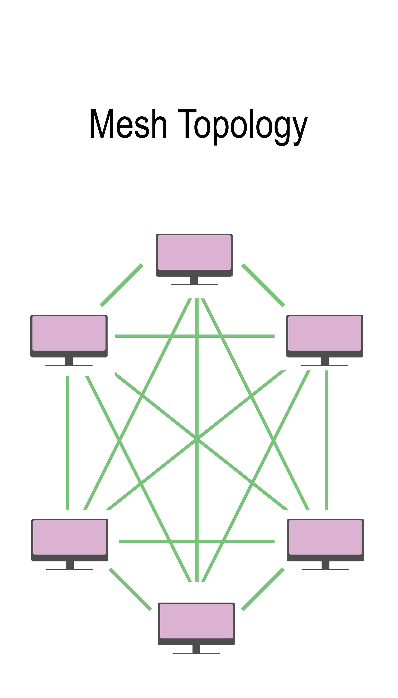
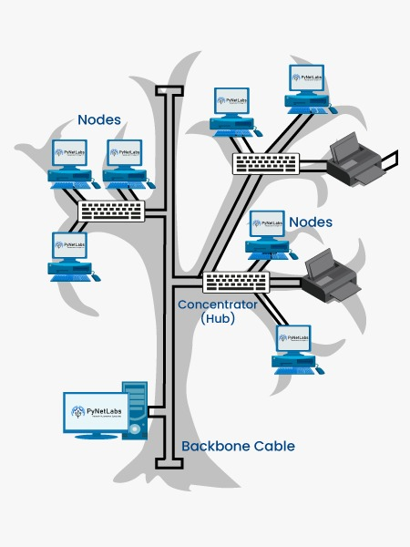
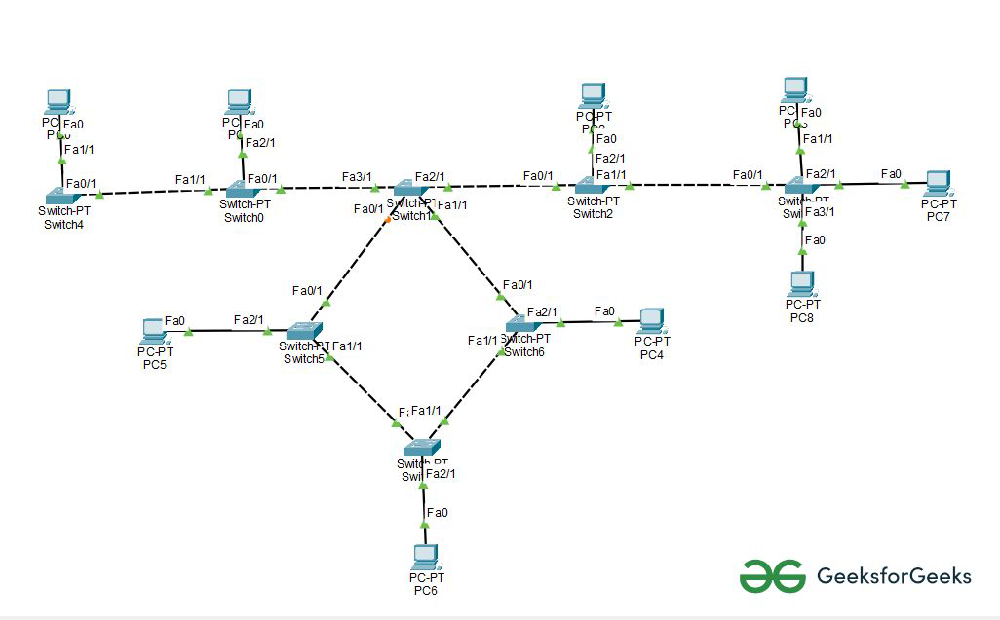

# Network Topologies

## Table of Contents
- [Network Topologies](#network-topologies)
  - [Table of Contents](#table-of-contents)
  - [Introduction](#introduction)
  - [Types of Network Topologies](#types-of-network-topologies)
    - [Bus Topology](#bus-topology)
    - [Star Topology](#star-topology)
    - [Ring Topology](#ring-topology)
    - [Mesh Topology](#mesh-topology)
    - [Tree Topology](#tree-topology)
    - [Hybrid Topology](#hybrid-topology)
  - [Comparison Table of Topologies](#comparison-table-of-topologies)
  - [Factors to Consider When Choosing a Topology](#factors-to-consider-when-choosing-a-topology)
  - [Conclusion](#conclusion)

---

## Introduction

A **network topology** refers to the physical or logical arrangement of devices (nodes), cables, and connections in a computer network. It defines how devices are interconnected and how data flows between them.

Network topologies can be categorized into **physical topology** (the actual layout of cables and devices) and **logical topology** (the path data takes regardless of the physical connections).

Understanding topologies is important for **network design, troubleshooting, scalability, and performance optimization**.

---

## Types of Network Topologies

### Bus Topology

* **Description**: All devices are connected to a single central cable (the backbone). Data is transmitted along the backbone and is received by all devices, but only the intended device accepts it.
* **Advantages**:
  * Simple to install and cost-effective (less cabling).
  * Works well for small networks.
* **Disadvantages**:
  * Entire network goes down if the backbone fails.
  * Difficult to troubleshoot.
  * Performance decreases with heavy traffic.
* **Use Cases**: Early LANs, small temporary networks.

---

### Star Topology

* **Description**: All devices are connected to a central device (hub, switch, or router). The central device manages data transmission.
* **Advantages**:
  * Easy to install and manage.
  * A failure in one device does not affect the rest of the network.
  * Centralized management improves troubleshooting.
* **Disadvantages**:
  * Failure of the central device brings down the whole network.
  * Requires more cabling than bus topology.
* **Use Cases**: Modern LANs, office and home networks.

---

### Ring Topology

* **Description**: Each device is connected to exactly two other devices, forming a closed loop (ring). Data travels in one direction (or both in a dual ring).
* **Advantages**:
  * Data flows in an orderly manner, reducing collisions.
  * Each device has equal access to resources.
* **Disadvantages**:
  * A failure in one device or cable can disrupt the entire network.
  * More difficult to troubleshoot than star topology.
* **Use Cases**: Older token ring networks, metropolitan area networks (MANs).

---

### Mesh Topology

* **Description**: Each device is connected to every other device in the network. Connections can be **full mesh** (every device has a link to all others) or **partial mesh** (some devices are interconnected).
* **Advantages**:
  * Very reliable (no single point of failure).
  * Supports high redundancy and fault tolerance.
  * Handles high traffic well.
* **Disadvantages**:
  * Very expensive (requires a lot of cabling and configuration).
  * Complex to install and maintain.
* **Use Cases**: Critical networks (military, financial systems, data centers).

---

### Tree Topology

* **Description**: A combination of star topologies arranged in a hierarchical manner, with a central root node and branches of devices.
* **Advantages**:
  * Scalable and easy to expand.
  * Allows for centralized management.
* **Disadvantages**:
  * If the root node fails, the entire network can be affected.
  * Requires more cabling than star topology.
* **Use Cases**: Large organizations, school campuses.

---

### Hybrid Topology

* **Description**: A combination of two or more topologies (e.g., star-bus, star-ring).
* **Advantages**:
  * Flexible and scalable.
  * Can be customized for specific organizational needs.
* **Disadvantages**:
  * Complex to design and maintain.
  * Expensive due to varied infrastructure requirements.
* **Use Cases**: Large enterprises with diverse networking needs.

---

## Comparison Table of Topologies

| Topology | Cost      | Reliability | Scalability | Ease of Troubleshooting | Example Use          |
| -------- | --------- | ----------- | ----------- | ----------------------- | -------------------- |
| Bus      | Low       | Low         | Low         | Hard                    | Small LANs           |
| Star     | Medium    | High        | High        | Easy                    | Home/office networks |
| Ring     | Medium    | Medium      | Low         | Medium                  | Older MANs           |
| Mesh     | Very High | Very High   | High        | Hard                    | Data centers         |
| Tree     | High      | Medium      | High        | Medium                  | Campuses             |
| Hybrid   | Very High | High        | Very High   | Complex                 | Enterprises          |

---

## Factors to Consider When Choosing a Topology

1. **Cost** – cabling, devices, and installation.  
2. **Scalability** – ease of expansion as the network grows.  
3. **Reliability** – ability to function despite failures.  
4. **Performance** – efficiency in handling network traffic.  
5. **Ease of Management** – troubleshooting and maintenance complexity.  

---

## Conclusion

Network topologies form the **foundation of network design**. Each topology has its strengths and weaknesses, and the choice depends on **budget, scale, performance requirements, and reliability needs**.  
In practice, most modern networks use a **hybrid approach**, combining the best features of different topologies.
