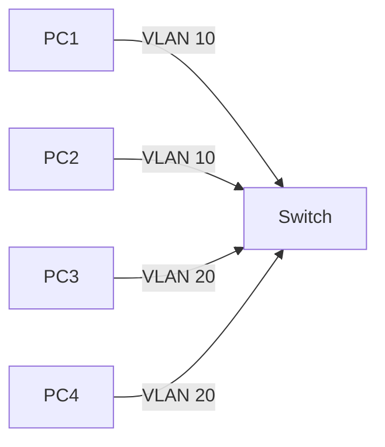

# Virtual LANs (VLANs)
>>>>>>> f76130d (Added Connectors note to beginner folder)

---

## Table of Contents

- [Virtual LANs (VLANs)](#virtual-lans-vlans)
  - [Table of Contents](#table-of-contents)
  - [Introduction](#introduction)
  - [Definition of VLAN](#definition-of-vlan)
  - [Purpose of VLANs](#purpose-of-vlans)
  - [Types of VLANs](#types-of-vlans)
  - [VLAN Operation](#vlan-operation)
  - [VLAN Tagging](#vlan-tagging)
  - [VLAN Configuration (Cisco Example)](#vlan-configuration-cisco-example)
  - [VLAN Diagrams](#vlan-diagrams)
    - [Access Port VLAN](#access-port-vlan)
    - [Trunk Port VLAN](#trunk-port-vlan)
    - [Inter-VLAN Routing](#inter-vlan-routing)
  - [VLAN Advantages](#vlan-advantages)
  - [VLAN Disadvantages](#vlan-disadvantages)
  - [VLAN Best Practices](#vlan-best-practices)
  - [Conclusion](#conclusion)

---

## Introduction

In modern networking, **Virtual LANs (VLANs)** are widely used to improve **network efficiency, security, and management**. VLANs allow network administrators to **segment a physical network into multiple logical networks** without requiring additional hardware.  

They are particularly useful in **large organizations** where different departments (e.g., HR, Finance, IT) need to be isolated for security or traffic reasons.

---

## Definition of VLAN

A **VLAN (Virtual Local Area Network)** is a **logical grouping of devices** on one or more LANs that behave as if they are on the same physical LAN, regardless of their physical location.  

**Key points:**  
- Devices in the same VLAN can communicate **as if they are on the same switch**, even if they are on different switches.  
- VLANs are defined **logically** rather than physically.  
- VLANs are identified by a **VLAN ID**, usually a number from 1 to 4094.

---

## Purpose of VLANs

1. **Segmentation of networks** – divide a network into smaller, manageable parts.  
2. **Improve security** – restrict sensitive data to specific VLANs.  
3. **Reduce broadcast domains** – limits broadcast traffic to a VLAN rather than the entire network.  
4. **Simplify network management** – allows changes without physical rewiring.  
5. **Enhanced performance** – reduces congestion by limiting unnecessary traffic.

---

## Types of VLANs

1. **Default VLAN** – All switch ports belong to VLAN 1 by default.  
2. **Data VLAN** – Carries user-generated traffic.  
3. **Voice VLAN** – Dedicated for VoIP traffic.  
4. **Management VLAN** – Used to access and manage network devices.  
5. **Native VLAN** – Assigned to untagged traffic on a trunk port.  
6. **Protocol VLAN** – Segregates traffic based on network protocol.  
7. **Private VLAN (PVLAN)** – Provides isolation between ports within the same VLAN.

---

## VLAN Operation

- VLANs operate at **Layer 2 (Data Link layer)** using **switches**.  
- **Within VLAN**: Devices communicate directly.  
- **Between VLANs**: Requires **router or Layer 3 switch** (inter-VLAN routing).

---

## VLAN Tagging

- **802.1Q (Dot1Q)**: Standard VLAN tag added to Ethernet frame.  
- **ISL (Inter-Switch Link)**: Cisco proprietary tagging.  

**Frame Types:**  
- **Untagged** – regular Ethernet frame (native VLAN).  
- **Tagged** – carries VLAN ID (trunk ports).

---

## VLAN Configuration (Cisco Example)

**Step 1: Create a VLAN**  
```bash
Switch(config)# vlan 10
Switch(config-vlan)# name HR
Switch(config-vlan)# exit
````

**Step 2: Assign VLAN to a port**

```bash
Switch(config)# interface FastEthernet0/1
Switch(config-if)# switchport mode access
Switch(config-if)# switchport access vlan 10
Switch(config-if)# exit
```

**Step 3: Configure Trunk Port**

```bash
Switch(config)# interface FastEthernet0/24
Switch(config-if)# switchport mode trunk
Switch(config-if)# switchport trunk allowed vlan 10,20,30
Switch(config-if)# exit
```

---

## VLAN Diagrams

### Access Port VLAN



* Each access port belongs to a single VLAN.
* Devices in the same VLAN can communicate directly.

---

### Trunk Port VLAN


* Trunk ports carry traffic for multiple VLANs.
* VLAN tagging identifies which VLAN each frame belongs to.

---

### Inter-VLAN Routing


* Devices in different VLANs need a **router or Layer 3 switch** to communicate.
* Router performs **inter-VLAN routing**.

---

## VLAN Advantages

1. **Improved security** – isolation between VLANs.
2. **Better performance** – limits broadcast domains.
3. **Simplified management** – logical grouping of devices.
4. **Flexibility** – easy device reassignment.
5. **Optimized VoIP traffic** – voice VLAN prioritization.

---

## VLAN Disadvantages

1. **Complex configuration** – mistakes can break connectivity.
2. **Troubleshooting difficulty** – logical separation adds complexity.
3. **Hardware dependency** – VLAN-capable switches required.
4. **Inter-VLAN routing needed** – extra layer for cross-VLAN communication.

---

## VLAN Best Practices

1. Assign VLANs based on **department or function**.
2. Use a **dedicated management VLAN**.
3. Keep **native VLAN separate** from user VLANs.
4. Use **trunk ports** only where necessary.
5. Document VLAN IDs, names, and port assignments.

---

## Conclusion

VLANs are a powerful tool for **network segmentation, security, and performance optimization**. They reduce broadcast traffic, improve management, and allow scalable network design.

Essential for **large enterprises, VoIP deployment, and multi-department offices**.